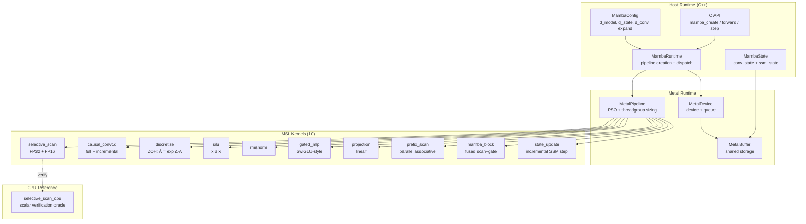
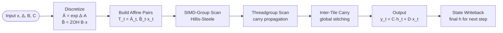
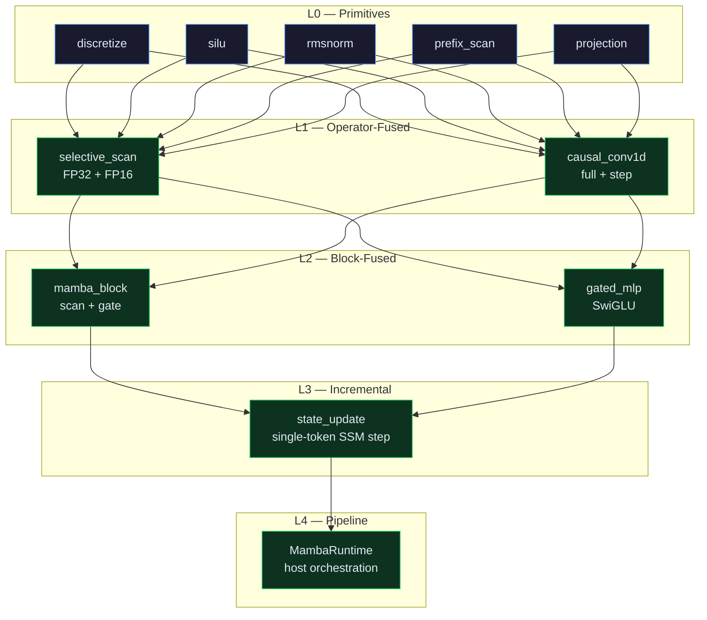

```text
+--------------------------------------+
|             MAMBA METAL              |
|   Native Mamba SSM on Apple Metal    |
+--------------------------------------+
```


---

## What is this?

Native Metal implementation of the Mamba / Selective State Space Model computational substrate. Not a wrapper around CUDA, PyTorch, or any existing Mamba extension. From-scratch implementation of the selective SSM recurrence, causal convolution, and full Mamba block written directly in Metal Shading Language with a minimal native host runtime.

```
MSL kernels → Metal compiler → Apple GPU (SIMD groups + threadgroups)
                                → associative selective scan + fused operators
```

No framework dependency. Pure Metal + C++/Objective-C runtime.

---

## Core Mathematical Primitive

Each timestep is an affine transformation of the hidden state:

```
h' = ā · h + b̄
```

Represented as the pair `T = (ā, b̄)`. Composition is associative:

```
(a₂, b₂) ⊗ (a₁, b₁) = (a₂·a₁, a₂·b₁ + b₂)
```

This allows the classic recurrent form `h_t = Ā_t h_{t-1} + B̄_t x_t` to be evaluated with a parallel prefix-scan (local → SIMD → threadgroup → global) instead of a purely serial loop. O(log L) depth instead of O(L).

---

## Architecture



## Selective Scan Pipeline



## Kernel Levels



---

## Memory Hierarchy

| Address space | Usage |
|--------------|-------|
| `device` | Input/output tensors, weights, final state |
| `constant` | Small parameter structs (ScanParams) |
| `threadgroup` | SIMD-group carries, shared tiles |
| `thread` | Per-timestep affines, A coefficients |

## Precision Policy

| Component | Precision | Rationale |
|-----------|-----------|-----------|
| Weights | FP16 or FP32 | Configurable |
| Δ, B, C projections | FP16 | Bandwidth reduction |
| **State accumulation** | **FP32** | Protects long-running product of Ā factors |
| Output | FP16 castable | Optional downcast |

---

## C API

```c
MambaConfig cfg = {
    .d_model = 512,
    .d_state = 16,
    .d_conv  = 4,
    .expand  = 2,
    .dtype   = MAMBA_F16
};

MambaModel *model = mamba_create(&cfg);
mamba_load_weights(model, weight_blob, weight_size);

// Full sequence
mamba_forward(model, input, output, batch, seq_len);

// Incremental (persistent state)
MambaStateHandle *state = mamba_create_state(model, batch);
for (int t = 0; t < seq_len; ++t)
    mamba_step(model, state, &input[t], &output[t]);
mamba_destroy_state(state);
mamba_destroy(model);
```

---

## Project Structure

```
mamba-metal/
├── Sources/
│   ├── Kernels/                  10 hand-written MSL shaders
│   │   ├── selective_scan.metal  Associative scan (FP32 + FP16) — 360 LOC
│   │   ├── causal_conv1d.metal   Full-sequence + incremental — 100 LOC
│   │   ├── mamba_block.metal     Fused scan + gate — 128 LOC
│   │   ├── rmsnorm.metal         RMS normalization — 81 LOC
│   │   ├── state_update.metal    Single-token SSM step — 57 LOC
│   │   ├── projection.metal      Linear projection — 49 LOC
│   │   ├── gated_mlp.metal       SwiGLU-style gate — 41 LOC
│   │   ├── prefix_scan.metal     Parallel associative scan — 40 LOC
│   │   ├── silu.metal            SiLU activation — 25 LOC
│   │   └── discretize.metal      ZOH discretization — 19 LOC
│   │
│   ├── Mamba/                    High-level runtime
│   │   ├── MambaConfig.hpp       Model configuration
│   │   ├── MambaState.hpp        Persistent inference state
│   │   ├── MambaRuntime.hpp      Runtime + C API — 87 LOC
│   │   └── MambaRuntime.cpp      Implementation — 181 LOC
│   │
│   ├── Runtime/                  Metal host runtime
│   │   ├── MetalDevice.hpp       Device + command queue
│   │   ├── MetalDevice.cpp       Device management — 58 LOC
│   │   ├── MetalBuffer.hpp       Shared storage buffers
│   │   ├── MetalBuffer.cpp       Buffer management — 27 LOC
│   │   ├── MetalPipeline.hpp     PSO + threadgroup sizing
│   │   └── MetalPipeline.cpp     Pipeline management — 39 LOC
│   │
│   └── CPURef/                   Verification oracle
│       ├── selective_scan_cpu.hpp CPU reference header — 39 LOC
│       └── selective_scan_cpu.cpp Scalar reference — 48 LOC
│
├── Tests/
│   ├── test_selective_scan.cpp   Scan correctness tests — 36 LOC
│   └── test_numerical.cpp        Associativity / zero / impulse — 70 LOC
│
├── Benchmarks/
│   └── bench_scan.cpp            Scan throughput microbenchmark — 47 LOC
│
├── Examples/
│   └── simple_forward.c          Minimal C API usage — 42 LOC
│
└── docs/
    └── architecture.md           Scan formulation + memory hierarchy
```

---

## Design Principles

| Principle | Enforcement |
|-----------|-------------|
| No framework dependency | Pure Metal + C++/ObjC runtime |
| Associative scan formulation | Parallel prefix over affine monoid |
| GPU-aware parallel scan | SIMD groups + threadgroup memory + hierarchical composition |
| Fused kernels | Minimize global memory traffic |
| Incremental inference | Persistent conv_state + ssm_state per batch |
| Configurable precision | FP32/FP16 weights; state always FP32 |
| Hardware adaptation | Runtime query of threadExecutionWidth + maxTotalThreadsPerThreadgroup |

---

## Build

Requires macOS + Xcode with Metal support.

```bash
cmake -B build -DCMAKE_BUILD_TYPE=Release
cmake --build build
```

---

## License

See [LICENSE](LICENSE) for details.
